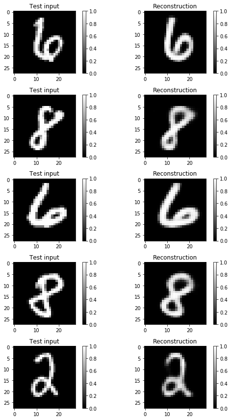
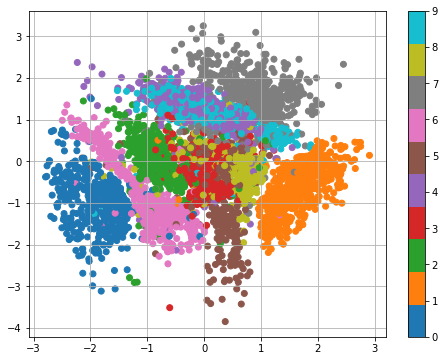
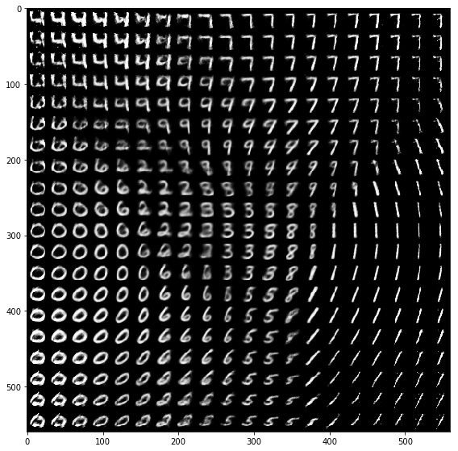

# Variational Autoencoder (VAE) in TensorFlow

_Based on the implementation from Jan Hendrik Metzen presented in [this](https://jmetzen.github.io/2015-11-27/vae.html) blog._

## Overview

Implementing a Variational Autoencoder in TensorFlow.

## Training the model

To generate the figures presented below I trained 2 models with a latent space of 20 (_./model/_) and 2 (_./model2D/_) dimensions.

In order to train a model you just need to provide the size of the latent space and the destination folder where the model will be saved/restored from.

`
python main.py --latent_dim=20 --save_path='./model/'
`

Use the flag `--restore` to continue training from a previously saved checkpoint.

`
python main.py --latent_dim=20 --save_path='./model/' --restore
`

## Reconstructed outputs

## Visualizing latent space

